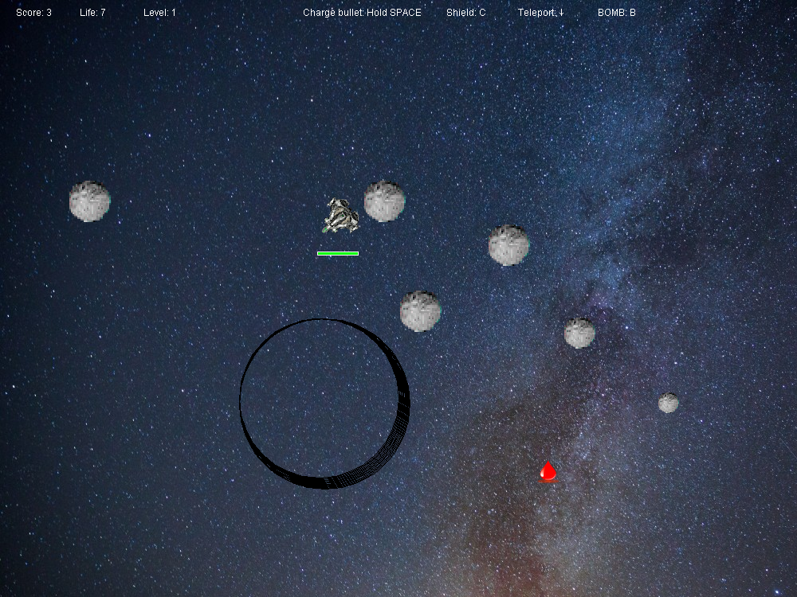
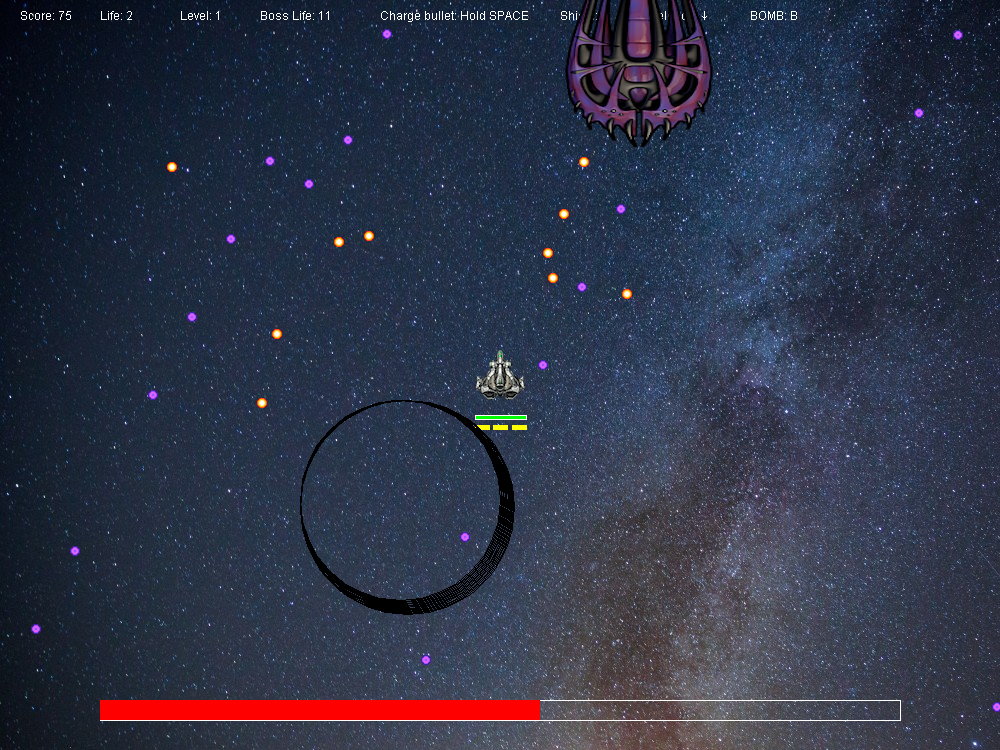
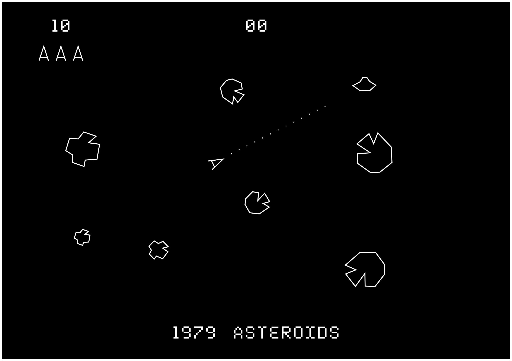
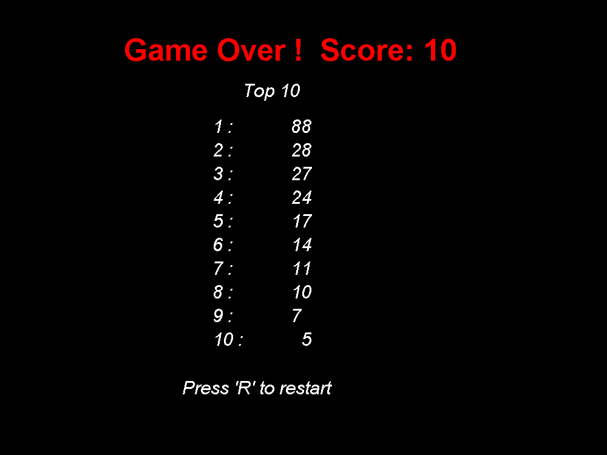

# Asteroid - CE218 assignment

**Please note**: This is a university assignment, you are not allowed to copy this repo in any way if you are making the same assignment.

# Introduction

The game is recreation of classic arcade game Asteroid in Java, the player controls the spaceship to destroy asteroids and defeat evil saucers. 

Respect to the old time arcade games!

# Tokens

**spaceship** (player)
Player should control spaceship to move and shoot 

**saucer** (boss)
Fight against player’s spaceship. There are 4 different bosses in game, each of them in each level. 

asteroid (large, medium, small)
large size at beginning, splitting to 2 smaller size ones after collision 

**bullet**
	spaceship	
		normal bullet : slow but long flying distance. 
		charge bullet : extremely high speed bullet, no interact with blackhole, flying time is short.
	saucer : slow but dense, hard to dodge 

**shield**
Spaceship is covered by shield, manually control. Shield consumes energy, which regenerates slowly. 

**boom**
Boss fight only, the spaceship have 3 bombs, the bomb destroy all saucer’s bullets. Not regeneratable. 

**gravity field **
The gravity field is fixed in somewhere of battlefield, it apply gravity to anything in the field. The dynamic energy is remained after escape of gravity field. 

**loots** 
3 kinds of loots will randomly drop by destroying small asteroids. 
	Heart: give one extra life to player 
	Star: reward scores to player 
	Shield: refill shield energy 

# Rules

\-       if spaceship hit asteroid, player get score 

\-       if spaceship get hit, player loses 1 life 

\-       if asteroid been hit, it split to smaller size. 

\-       if small asteroid been hit, it disappear and drop loot 

\-       if all steroid clear, enter boss fight 

\-       if spaceship’s hit point lower than 0, game over 

\-       if saucer’s hit point lower than 0, level complete , level up

\-       if complete 4 levels, game finish.

\-       if asteroid , spaceship , bullets and saucer enters the gravity field, gravity will apply immediately 

\-       if shield collide with asteroid, it pushes asteroid away. 

# Control

**Arrow keys:**

\-       up : thrust

\-       left: turn left 

\-       right : turn right 

\-       down : teleport to random position 

 

**C**: activation of shield 

**B**: drop bomb 

**Space**: shoot 

**Hold Space**: charge shoot 

**Esc**: Exit game 

**R**: restart 

# Implementation (assignment report)

Game objects hierarchy 

In order to manage tokens efficiently, an abstract class GameObject is created for extension. 

Every game object has position, velocity and radius, they also have a “dead” to indicate death or alive. 

The updata method changes the position every frame. The game objects update their position by calling super.update()

draw , toString and hit methods should implement by individual game object, depends on what they are.  

The overlap method detect the distance between 2 objects, if the distence of them less than the sum of radius, they’re hitting each other. 

The collisionHandling methods deals with all actions when collision happened. Simply say, what happened to A if A collide with B. For example, charge bullet collide with gravity shield, nothing happen to chage bullet. But, if spaceship collide with saucer, spaceship dead. In my programe, the collision detection is one way, which means if A collide with B, only B is affected. If A should be affected too, detection of B collide with A should be added. The reason I use this approach is because it gives the maximum flexibility to apply suitable action. The toString method is shocking useful in collisionHandling method, I didn’t implement toString at first place so It is difficult to distinguish game objects when dealing who collide with who. By implement toString method, I give names to game objects and it makes me select them easily. It is also easier to maintain the code and increased readability.

 

Actions 

Several actions should apply to spaceship and saucers, so they can be controlled, a class Action is createed to store status of each action. for example “boolean teleport“ is a trigger of teleport method. 

 

Vector2D

The Vector2D class is created for better performance and management of positions. At first, I don’t like it because it is complex to learn vector calculations but, in the end, I realize this vector thing is effective and efficiency. It merges the X, Y in one single type. 

 

Asteroids

I created 3 sizes of asteroids, they are large, medium and small. 

makeRandomAsteroid method generate given number of asteroids with random position and velocity. If the position is very close to center point where the spaceship will generate, a new position will assign to that asteroid to avoid instant collide. 

The draw method draws asteroids in different sizes, depends on radius. Affine transform scale applied to enlarge the picture. 

The hit method describes the actions performed after collision, if the size of current asteroid is either large or medium, it will split. meanwhile, player get score and loot. 

The split methods simple created 2 asteroid instances and give them same posion with hitted one and random velocity, so the split asteroid fly randomly. 

A list called splits was created for storing split asteroids in order to add them to alive game objects. I will explain this part later. 

The loot methods check the radius of asteroid, if it is the small asteroid, it will drop loot. a random loot system was created by using random numbers between 0 to 10. Three different kind of items are designed, each of them has a tag, indicate what item are them. there are 40% chance to generate tag 1 item (star), 30% of blood, 30% of shield. generated loot will add to a list called items. 

Item 

The tags indicate items, 1 is star, 2 is blood, 3 is shield. The draw method draw images depends on tag. the hit methods indicates the reward of player pickup the items. 10 scores for star, 1 life for blood, 50 energy for shield. 

 

Ship 

The Ship class is an abstract class that extended GameObject, it has two children : Player’s spaceship and enemy saucer. This class calls update method of GameObject, several methods left to implement. 

 

Spaceship 

Spaceship is controlled by player, the constructor is used to create a general game object, additionally, a controller is assigned, and direction is pointing to up. 

The update method is complex, super.update() is called to change positions, besides, the direction is changed based on angle, the trigger of turning is controlled by player, it multiply with DT and STEER_RATE to get angle of turning, thus changes the direction. 

The DRAG constant is slowing down the player ship constantly, the velocity of spaceship is multiply with 0.99 every frame, the speed will close to 0 gradually. 

Other than that, a trigger shoot is controlled by player, if spaceship shoot, a bullet will create. same as shield trigger, when shield is on, the energy will constantly decrease until 0 or turned off by player, then the energy increase automatically until full energy. 

If life is 0, game is over. 

The draw function draws everything related to spaceship, Affine Transform is applied to draw spaceship. A shield bar is created, when energy is more than 0, it will draw a green energy bar as an energy indicator. A charge bar is designed for charge bullet, it works similar with energy bar, but the color is red, in order to distinguish charge bullet and normal bullet, the charge bar only appear after player holding space for a while. A bomb bar contains three bombs at most, the number of bombs is indicated in yellow blocks, “through case issue” is well used in code. 

The mkBullet method makes bullet for spaceship, they are divided to charge bullet and normal bullet. The velocity is different, charge bullet is 10 times faster than normal bullet, it provides instant strike to enemy. 

If spaceship been hit, player lose life, position back to center point of screen. Restore direction to up as well. 

The teleport method set position of spaceship randomly. Player could teleport to avoid upcoming collision. 

 

Saucer 

The saucer only appears when player clear all the asteroids in battlefield. It is considered as boss fight, there are 4 different saucers in game, each one in a level. If player can beat them all, then player win the game. The Hit point of saucer increases every level. 

The constructor is same as spaceship, the difference is the controller. Spaceship is controlled by player whereas saucer is controlled by Saucer_Action1/2/3/4.class 

The draw method and mkBullet methods is similar with spaceship so I don’t talk too much about it. 

 

Saucer_Actions

The saucers are controlled by controller called “Saucer_Action.class”, it implements the Controller interface. An action instance is created for controlling saucer. 

In this game, the saucer has fixed Hit point that increases every level. A counter is created for controlling frequency of bullets. For example, if count%50 = 0 means saucer fire bullet every 50 frame, which is 1 second per bullet. The frequency will slightly increase if saucer ‘s HP lower than certain amount. If saucer almost dead, the movement become unpredictable and player should take care to avoid any collision. 

 

Bullet

There are 3 kinds of bullets: normal bullet from spaceship, charge bullet from spaceship, bullet from saucer. 

The Ship instance call mkBullet to create bullet. 

Depends on tag of each kind of bullet, the draw method performs differently. 

Normal bullet is small yellow dot, charge bullet is purple laser, saucer bullet is small purple dot. 

In update method, I assign different flying time to each bullet. 

 

Gravity force field 

The gravity force field is located at (300,400) with radius of 100. The position of gravity force is fix. I draw 10 circles to create a 3D field. The gravity field interacts with other game objects in Collision handling class, it affects almost everything who collide with, a downward velocity will add to current velocity. 

 

Keys

Two override methods are used in KeyAdapter: KeyPressed and KeyReleased, they perform actions when player press or release button. 

 

Game 

This class plays the greatest role of running the game. In the constructor, all kind of game objects are created and add to objects list. 

The main method simple create instance and update game states every frame. A short delay for each time drawing. So, people can see the game is “moving”.

In the update method, alive list is created for indicated whether a game object is dead, if it is alive, then game should draw it on screen. Each time game updates, game check the status of game objects, after filtering, only alive objects left, then, perform suitable actions individually. 

In the addScore method, every time been called, the score plus one, a static variable bonus for store rewarding life for every N scores. There is an award threshold, if bonus larger than threshold, an extra life will be given to player. Threshold increases when level up. 

The levelup method describes what happened when boss been defeated, first of all, clear all game objects because new objects will be added shortly. If level greater than 4, then game is over. And initial amount of asteroid will increase 2. For example, there are 5 asteroids in level 1, so, there are 7 asteroids in level 2. As mentioned, the award threshold will increase. Bullet flying time will increase as well.

The over method returns a string based on condition. If player win the game, a congratulate string will output, if defeated, a “game over” will display. In any case, the score will be display along with. High score is working in this method as well, I will talk about it later. 

If game is over, player could press “R” to restart the game. Everything will restore to level 1. Player could start game from beginning. 

 

View

View class controls the GUI of game. It extends from JComponents. In paintComponent method, I drew basic game screen and game over screen. Proper information is displayed on top of screen. If during boss fight. A long red HP bar will display. 

 

High Score 

The scores are stored in a .txt file, I put them in a set and sort them from big to small. Then pick first 10 scores as high score. It raised an issue that “/n” is not working in drawstring method, I spilt them and draw them line by line. See code below:

for (String line: HighScore.top10(). split("\n"))
         g. drawString (line, 350, y += g. getFontMetrics (). getHeight ());
 } 

 

Image and sound 

The media files are controlled by ImageManager and SoundManager. Most images are downloaded from internet with no copyright. Some sound effect like “biu biu biu “is recorded by myself. 

 

 

Tune 

The game looks easy, but it is hard to get perfect balance between gameplay and difficulty. At first, the bullet is fast and easily hit asteroid, so I slow it down, and in the first level, I change the bullet flying time thus bullet will not hit space ship if player keep shooting without moving, but, at level 2, the bullet flying time increases 0.5 sec, if player keep shooting with moving, the bullet will hit spaceship. 

At first, I decided give player 3 lives only, it’s difficult in boss fight. A good player could avoid hitting with asteroid but not possible during boss fight, so, I increase the initial life to 10 and give large amount of blood items in loot. Basically, a good player could get 15 or more lives before boss fight. 

The Bomb is not possible to regenerate, so player should use is wisely, it doesn’t harm anyone except remove all bullets. My suggestion is only use bomb when bullets are dense. 

The Boss’s AI is difficult to balance, I firstly make the Boss AI too complex, the bullet is dense and the boss moving very fast, it dodge bullet in advance automatically. The player has no chance to beat that boss. So, I make the boss a little simple, increase difficulty step by step. 

The shield was designed to destroy everything collide, then I realize it was too over powerful, so the shield now does not collide with asteroid, the shield pushes the asteroid away for some distance, and the shield lose 50 energies. Also, the speed of energy has adjusted many times. 

The loot system was added to game at last minute, I add this system because it actually makes the game more balance. More importantly, the moving items make player more likely to move and shoot instead of staying in center point and aim. 

I was make the gravity force randomly change position after a while, it’s not a good idea. The gravity field put too many uncertainties into the game and make the game not fun. Player pay more attention on prepare for the objects that suddenly changed direction and velocity. 

 

Appraisal 

 

The game takes me at least 70 hours to polish, the lab sections are considered medium difficulty for me, I can follow the lab instructions. I guess I spend 15% of the total time to make a playable basic game with simple circles. The rest of time are full of hard work. I play game, I like game, I know what kind of game is interesting, I respect my work as it is a publishing game. According to GitHub record, I iterate the game for more than 50 times. each time I make a small change to it. It’s Agile software development. It is the first time I get benefit from this development method. I will keep using Agile in the further development. 

There are thousands of small problems during the game development, basically I can say I never made some function without any problem come out. Each iteration is a tough fight with bugs. I didn’t see any oblivious bugs in the final edition, but I believe they do exist. 

The difficulty is think and think and think, what’s going on in the game. I spend lots of time on debugging, sometimes I thought my logic is prefect, but it is full of holes. Instead of learning from making game, I think I learn more from clearing bugs. 

Although the game is well enough to play, but I don’t consider my code is concise and elegant. The structure is skeleton of game, I think I made it well, but I think I could make the program more Object Oriented in the future.  

In conclusion, it’s hard to summary the list of what I’ve gained from making this game, but I do feel I have better understanding of how to make a game, from structure to functions. I really proud of my work and I get good feedbacks from friends, that’s the best reward for me. 

 

*[end of doc]*
